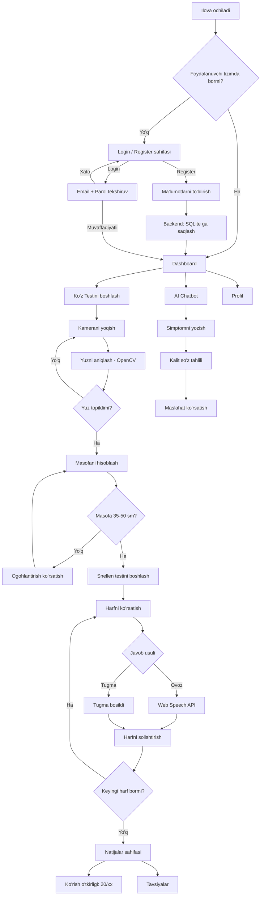

# Eye Gem — Dastur Oqimi (Flowchart)

```mermaid
flowchart TD
    A["Ilova ochiladi"] --> B{"Foydalanuvchi tizimda bormi?"}
    B -- Yo'q --> C["Login / Register sahifasi"]
    B -- Ha --> D["Dashboard"]
    C --> |Register| E["Ma'lumotlarni to'ldirish"]
    E --> F["Backend: SQLite ga saqlash"]
    F --> D
    C --> |Login| G["Email + Parol tekshiruv"]
    G --> |Muvaffaqiyatli| D
    G --> |Xato| C

    D --> H["Ko'z Testini boshlash"]
    D --> I["AI Chatbot"]
    D --> J["Profil"]

    H --> K["Kamerani yoqish"]
    K --> L["Yuzni aniqlash - OpenCV"]
    L --> M{"Yuz topildimi?"}
    M -- Yo'q --> K
    M -- Ha --> N["Masofani hisoblash"]
    N --> O{"Masofa 35-50 sm?"}
    O -- Yo'q --> P["Ogohlantirish ko'rsatish"]
    P --> N
    O -- Ha --> Q["Snellen testini boshlash"]

    Q --> R["Harfni ko'rsatish"]
    R --> S{"Javob usuli"}
    S --> |Ovoz| T["Web Speech API"]
    S --> |Tugma| U["Tugma bosildi"]
    T --> V["Harfni solishtirish"]
    U --> V
    V --> W{"Keyingi harf bormi?"}
    W -- Ha --> R
    W -- Yo'q --> X["Natijalar sahifasi"]

    X --> Y["Ko'rish o'tkirligi: 20/xx"]
    X --> Z["Tavsiyalar"]

    I --> AA["Simptomni yozish"]
    AA --> AB["Kalit so'z tahlili"]
    AB --> AC["Maslahat ko'rsatish"]
```
